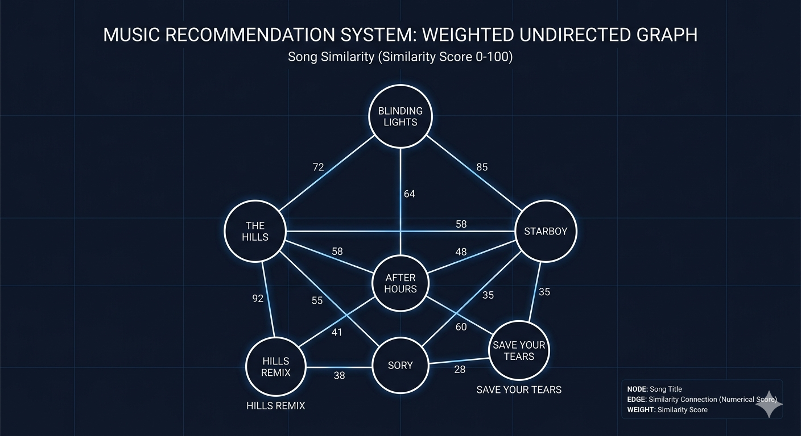

# Moodify: Backend & Graph-Based Recommendation Engine

Moodify is a music recommendation system that uses Graph Theory and Hashing to generate mood-consistent playlists. This repository focuses on the core backend architecture, C++ algorithm integration, and similarity logic.

## Key Contributions (Backend & DSA)
- **Graph-Based Similarity:** Developed a weighted undirected graph where songs are nodes and edges represent similarity scores.
- **Efficient Data Retrieval:** Implemented Hash Maps for $O(1)$ song lookups and a Trie structure for fast prefix-based song searching.
- **Hybrid Architecture:** Designed a system where a Python API (`backend.py`) communicates with a high-performance C++ engine (`moodify.exe`).

## Similarity Logic
To ensure smooth transitions between tracks, the system calculates edge weights based on:
- **Mood Match:** +50 points
- **Genre Match:** +30 points
- **Tempo Alignment:** Up to +30 points
*An edge is only created between songs if the total similarity score exceeds 30.*

## System Visualization

*Figure 1: Visualization of the weighted song similarity graph and song connectivity.*

## Project Structure
- **src/**: Core C++ implementation (Graph Builder, Datastore, Search Engine).
- **backend.py**: Lightweight Python server handling API requests.
- **data/**: Song metadata (CSV) and mood mapping configurations.
- **songs/**: Audio repository for the application.
- **Makefile**: Automation for compiling the C++ source code.

## Tech Stack
- **Languages:** C++, Python
- **Data Structures:** Graphs (Adjacency Lists), Hash Maps, Trie, Priority Queues
- **Algorithms:** Breadth-First Search (BFS) for mood-based traversal
